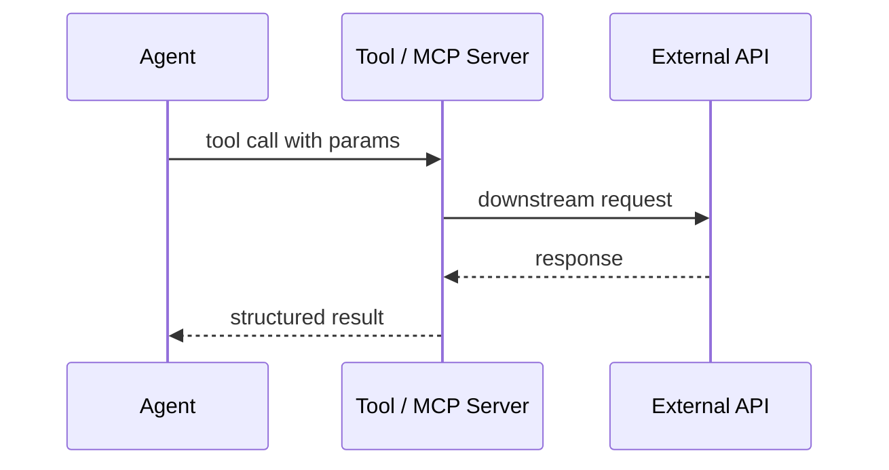
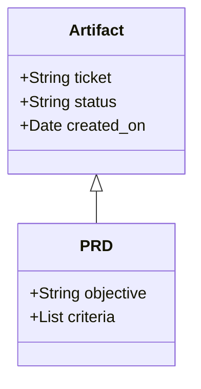
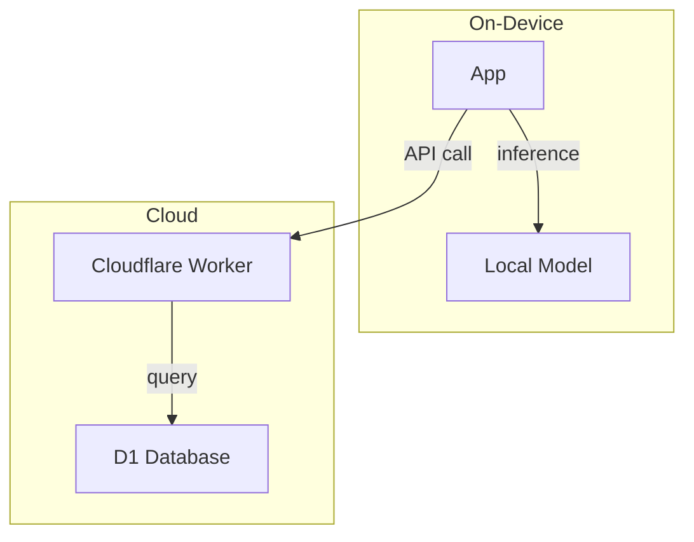
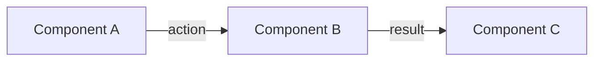
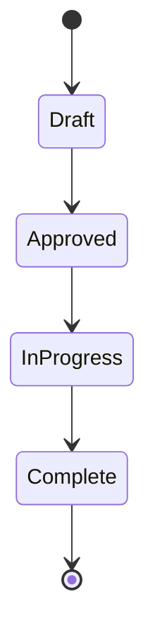

# Generate UML Diagram

Produce a Mermaid diagram that documents system structure or behavior. Output goes to `.orchestra/uml/`.

## Diagram Types

Choose the type that matches what you're documenting:

| Type | Use When | Mermaid Block |
|------|----------|---------------|
| **sequence** | Agent-to-tool flows, multi-step workflows, API call chains | `sequenceDiagram` |
| **class** | Data models, object relationships, schema structure | `classDiagram` |
| **deployment** | On-device vs cloud allocation, infrastructure topology | `graph TB` with subgraphs |
| **component** | High-level system overview, major pieces and connections | `graph LR` |
| **state** | Workflow states, agent decision logic, valid transitions | `stateDiagram-v2` |

## Steps

### 1. Identify the Diagram Type

Read $ARGUMENTS. If no type is given, ask:
- Is this about the *flow* of an interaction? → sequence
- Is this about *data shape* or relationships? → class
- Is this about *where things run*? → deployment
- Is this about *what the major pieces are*? → component
- Is this about *states and transitions*? → state

### 2. Gather Context

- Glob relevant source files, skill definitions, or agent configs
- Read existing `.orchestra/uml/` diagrams to avoid duplication and match style
- Read the active milestone PRD for scope

### 3. Generate the Diagram

Use the appropriate Mermaid syntax:

**Sequence:**


**Class:**


**Deployment:**


**Component:**


**State:**


### 4. Write the File

Save to `.orchestra/uml/{project}-{type}-{purpose}.md`

Naming convention: `[project]-[diagram-type]-[purpose].md`
- `chiropractic-sequence-soap-pipeline.md`
- `orchestra-component-plugin-structure.md`
- `kairos-state-daily-rhythm.md`

Include frontmatter per ADR-001 (UML carries `created_on` only — no status, no ticket):

```yaml
---
created_on: {YYYY-MM-DD}
---
```

Full file structure:
```markdown
---
created_on: YYYY-MM-DD
---

# {Diagram Title}

> {One sentence: what this diagram shows and why it exists}

```mermaid
{diagram code}
```

## Notes

{Optional: call out non-obvious decisions, constraints, or what to look at first}

## References

- {Spec, ADR, or external doc this diagram relates to}
```

### 5. Cross-Reference

If this diagram was prompted by a spec or ADR, add a reference line to that document pointing back to the diagram. The relationship is:
- **Specs** document *what* — reference the UML for *how*
- **ADRs** document *why* — reference the UML for the topology that resulted from the decision

## Examples

See `examples/` for reference diagrams:

| File | Type | What It Shows |
|------|------|---------------|
| `examples/sequence.md` | sequence | Multi-phase agent workflow with parallel tool calls and retry logic |

## Quality Checks

- [ ] Diagram type matches what's being shown (don't use sequence for topology)
- [ ] Participants and nodes have human-readable labels, not code identifiers
- [ ] Mermaid syntax is valid — no unclosed blocks, correct arrow types
- [ ] Filename follows `[project]-[type]-[purpose].md` convention
- [ ] `created_on` frontmatter is present
- [ ] One sentence description is present below the title
