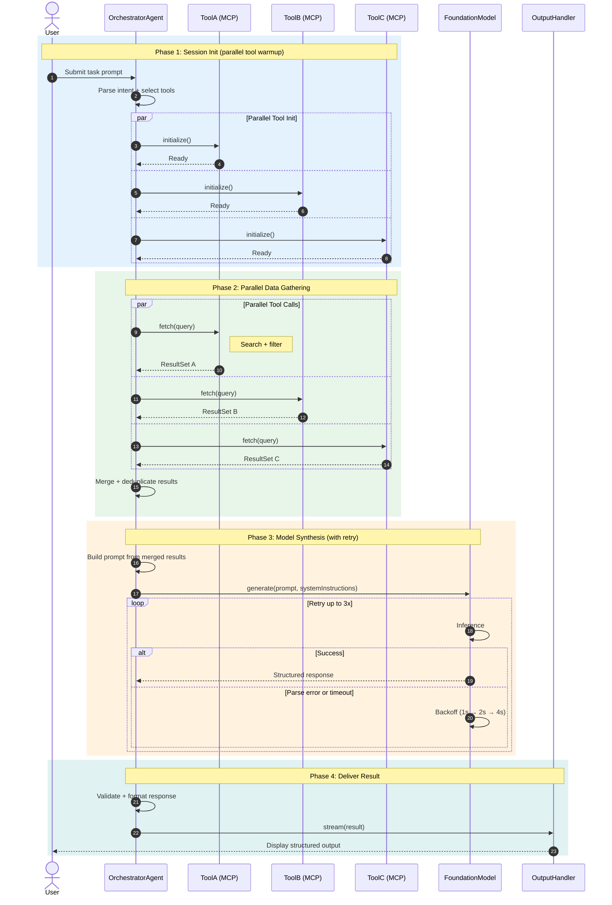

# Agent Task Execution — Sequence Diagram

> Illustrates a multi-phase agentic workflow: parallel tool loading, parallel inference, retry-backed model call, and structured result delivery.

## Key Patterns Demonstrated

- **`autonumber`** — auto-increments step labels for reference in docs and reviews
- **`actor`** — use for humans; `participant` for systems/agents/services
- **`rect rgb(...)`** — color-coded phases make complex flows scannable
- **`par` / `and`** — parallel execution blocks; essential for agentic systems with concurrent tool calls
- **`loop`** — retry logic with bounded attempts
- **`alt` / `else`** — conditional branching (success vs. failure paths)
- **`Note over`** — phase labels that span multiple participants
- **`->>`** / **`-->>`** — solid arrow = call/request, dashed arrow = return/response

## When to Use This Pattern

Use a sequence diagram when documenting:
- Agent-to-tool interactions with specific ordering
- Parallel MCP server calls and their merge point
- Retry or fallback logic in model calls
- Multi-phase workflows where phase boundaries matter

## How to Render

1. **GitHub** — paste into any `.md` file; renders natively
2. **VS Code** — install the "Mermaid Preview" extension
3. **Online** — [mermaid.live](https://mermaid.live) for interactive editing and export
4. **Obsidian / Notion** — both render Mermaid code blocks natively

## References

- [Mermaid sequenceDiagram docs](https://mermaid.js.org/syntax/sequenceDiagram.html)
- orchestra:uml skill (uml/SKILL.md)
